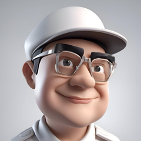

# Offcanvas

Bootstrap component documentation and examples.

## Offcanvas With Link

### Description
Offcanvas component demonstrating various styling and layout patterns.

### Key Bootstrap Classes

- `.btn`
- `.btn-close`
- `.btn-outline-danger`
- `.btn-outline-success`
- `.btn-primary`
- `.d-flex`
- `.display-4`
- `.fw-light`
- `.gap-2`
- `.img-5x`
- `.lh-lg`
- `.mb-3`

### HTML Pattern

```html
<a class="btn btn-primary" data-bs-toggle="offcanvas" href="#offcanvasLinkExample" role="button"
aria-controls="offcanvasLinkExample">
Link With Href
</a>
<div class="offcanvas offcanvas-start" tabindex="-1" id="offcanvasLinkExample"
aria-labelledby="offcanvasLinkExampleLabel">
<div class="offcanvas-header">
<h5 class="offcanvas-title" id="offcanvasLinkExampleLabel">Offcanvas</h5>
<button type="button" class="btn-close" data-bs-dismiss="offcanvas" aria-label="Close"></button>
</div>
<div class="offcanvas-body">
<h1 class="display-4 text-primary">Hello,</h1>
<h5 class="mb-3 fw-light lh-lg">
FREE and Premium admin dashboard and admin panel themes. Built on top of Bootstrap 5, provides
a range of responsive, reusable, commonly used widgets and UI components.
</h5>
<div class="stacked-images mb-3">




</div>
<div class="d-flex gap-2">
<a href="#" class="btn btn-outline-danger">Card link</a>
<a href="#" class="btn btn-outline-success">Another link</a>
```

---

## Enable Body Scrolling

### Description
Offcanvas component demonstrating various styling and layout patterns.

### Key Bootstrap Classes

- `.btn`
- `.btn-close`
- `.btn-primary`
- `.offcanvas`
- `.offcanvas-body`
- `.offcanvas-header`
- `.offcanvas-start`
- `.offcanvas-title`

### HTML Pattern

```html
<button class="btn btn-primary" type="button" data-bs-toggle="offcanvas"
data-bs-target="#offcanvasScrolling" aria-controls="offcanvasScrolling">Enable Body
Scrolling</button>
<div class="offcanvas offcanvas-start" data-bs-scroll="true" data-bs-backdrop="false" tabindex="-1"
id="offcanvasScrolling" aria-labelledby="offcanvasScrollingLabel">
<div class="offcanvas-header">
<h5 class="offcanvas-title" id="offcanvasScrollingLabel">Offcanvas with body scrolling</h5>
<button type="button" class="btn-close" data-bs-dismiss="offcanvas" aria-label="Close"></button>
</div>
<div class="offcanvas-body">
<p>Try scrolling the rest of the page to see this option in action.</p>
```

---

## Enable Body Scroll & Backdrop

### Description
Offcanvas component demonstrating various styling and layout patterns.

### Key Bootstrap Classes

- `.btn`
- `.btn-close`
- `.btn-primary`
- `.offcanvas`
- `.offcanvas-body`
- `.offcanvas-header`
- `.offcanvas-start`
- `.offcanvas-title`

### HTML Pattern

```html
<button class="btn btn-primary" type="button" data-bs-toggle="offcanvas"
data-bs-target="#offcanvasWithBothOptions" aria-controls="offcanvasWithBothOptions">Enable Both
Scrolling & Backdrop</button>
<div class="offcanvas offcanvas-start" data-bs-scroll="true" tabindex="-1"
id="offcanvasWithBothOptions" aria-labelledby="offcanvasWithBothOptionsLabel">
<div class="offcanvas-header">
<h5 class="offcanvas-title" id="offcanvasWithBothOptionsLabel">Backdrop with scrolling</h5>
<button type="button" class="btn-close" data-bs-dismiss="offcanvas" aria-label="Close"></button>
</div>
<div class="offcanvas-body">
<p>Try scrolling the rest of the page to see this option in action.</p>
```

---

## Static Offcanvas

### Description
Offcanvas component demonstrating various styling and layout patterns.

### Key Bootstrap Classes

- `.btn`
- `.btn-close`
- `.btn-primary`
- `.offcanvas`
- `.offcanvas-body`
- `.offcanvas-header`
- `.offcanvas-start`
- `.offcanvas-title`

### HTML Pattern

```html
<button class="btn btn-primary" type="button" data-bs-toggle="offcanvas"
data-bs-target="#staticBackdrop" aria-controls="staticBackdrop">
Toggle Static Offcanvas
</button>
<div class="offcanvas offcanvas-start" data-bs-backdrop="static" tabindex="-1" id="staticBackdrop"
aria-labelledby="staticBackdropLabel">
<div class="offcanvas-header">
<h5 class="offcanvas-title" id="staticBackdropLabel">Offcanvas</h5>
<button type="button" class="btn-close" data-bs-dismiss="offcanvas" aria-label="Close"></button>
</div>
<div class="offcanvas-body">
<div>
I will not close if you click outside of me.
```

---

## Offcanvas Left

### Description
Offcanvas component demonstrating various styling and layout patterns.

### Key Bootstrap Classes

- `.btn`
- `.btn-close`
- `.btn-outline-danger`
- `.btn-outline-success`
- `.btn-primary`
- `.d-flex`
- `.fw-light`
- `.gap-2`
- `.img-5x`
- `.mb-3`
- `.offcanvas`
- `.offcanvas-body`

### HTML Pattern

```html
<button class="btn btn-primary" type="button" data-bs-toggle="offcanvas"
data-bs-target="#offcanvasExample" aria-controls="offcanvasExample">
Offcanvas Left
</button>
<div class="offcanvas offcanvas-start" tabindex="-1" id="offcanvasExample"
aria-labelledby="offcanvasExampleLabel">
<div class="offcanvas-header">
<h5 class="offcanvas-title" id="offcanvasExampleLabel">Offcanvas</h5>
<button type="button" class="btn-close" data-bs-dismiss="offcanvas" aria-label="Close"></button>
</div>
<div class="offcanvas-body">
<p class="mb-3 fw-light">
FREE and Premium admin dashboard and admin panel themes. Built on top of Bootstrap 5, provides
a range of responsive, reusable, commonly used widgets and UI components.
</p>
<div class="stacked-images mb-3">


</div>
<div class="d-flex gap-2">
<a href="#" class="btn btn-outline-danger">Card link</a>
<a href="#" class="btn btn-outline-success">Another link</a>
```

---

## Offcanvas Top

### Description
Offcanvas component demonstrating various styling and layout patterns.

### Key Bootstrap Classes

- `.btn`
- `.btn-close`
- `.btn-primary`
- `.d-flex`
- `.fw-light`
- `.gap-2`
- `.img-3x`
- `.img-fluid`
- `.mb-3`
- `.offcanvas`
- `.offcanvas-body`
- `.offcanvas-header`

### HTML Pattern

```html
<button class="btn btn-primary" type="button" data-bs-toggle="offcanvas"
data-bs-target="#offcanvasTop" aria-controls="offcanvasTop">Offcanvas Top</button>
<div class="offcanvas offcanvas-top" tabindex="-1" id="offcanvasTop"
aria-labelledby="offcanvasTopLabel">
<div class="offcanvas-header">
<h5 class="offcanvas-title" id="offcanvasTopLabel">Offcanvas Top</h5>
<button type="button" class="btn-close" data-bs-dismiss="offcanvas" aria-label="Close"></button>
</div>
<div class="offcanvas-body">
<p class="mb-3 fw-light">
FREE and Premium admin dashboard and admin panel themes. Built on top of Bootstrap 5, provides
a range of responsive, reusable, commonly used widgets and UI components.
</p>
<div class="d-flex gap-2">


```

---

## Offcanvas Right

### Description
Offcanvas component demonstrating various styling and layout patterns.

### Key Bootstrap Classes

- `.btn`
- `.btn-close`
- `.btn-primary`
- `.d-flex`
- `.fw-light`
- `.gap-2`
- `.img-3x`
- `.img-fluid`
- `.mb-3`
- `.offcanvas`
- `.offcanvas-body`
- `.offcanvas-end`

### HTML Pattern

```html
<button class="btn btn-primary" type="button" data-bs-toggle="offcanvas"
data-bs-target="#offcanvasRight" aria-controls="offcanvasRight">Offcanvas Right</button>
<div class="offcanvas offcanvas-end" tabindex="-1" id="offcanvasRight"
aria-labelledby="offcanvasRightLabel">
<div class="offcanvas-header">
<h5 class="offcanvas-title" id="offcanvasRightLabel">Offcanvas Right</h5>
<button type="button" class="btn-close" data-bs-dismiss="offcanvas" aria-label="Close"></button>
</div>
<div class="offcanvas-body">
<p class="mb-3 fw-light">
FREE and Premium admin dashboard and admin panel themes. Built on top of Bootstrap 5, provides
a range of responsive, reusable, commonly used widgets and UI components.
</p>
<div class="d-flex gap-2">


```

---

## Offcanvas Bottom

### Description
Offcanvas component demonstrating various styling and layout patterns.

### Key Bootstrap Classes

- `.btn`
- `.btn-close`
- `.btn-primary`
- `.d-flex`
- `.fw-light`
- `.gap-2`
- `.img-3x`
- `.img-fluid`
- `.mb-3`
- `.offcanvas`
- `.offcanvas-body`
- `.offcanvas-bottom`

### HTML Pattern

```html
<button class="btn btn-primary" type="button" data-bs-toggle="offcanvas"
data-bs-target="#offcanvasBottom" aria-controls="offcanvasBottom">Offcanvas Bottom</button>
<div class="offcanvas offcanvas-bottom" tabindex="-1" id="offcanvasBottom"
aria-labelledby="offcanvasBottomLabel">
<div class="offcanvas-header">
<h5 class="offcanvas-title" id="offcanvasBottomLabel">Offcanvas Bottom</h5>
<button type="button" class="btn-close" data-bs-dismiss="offcanvas" aria-label="Close"></button>
</div>
<div class="offcanvas-body small">
<p class="mb-3 fw-light">
FREE and Premium admin dashboard and admin panel themes. Built on top of Bootstrap 5, provides
a range of responsive, reusable, commonly used widgets and UI components.
</p>
<div class="d-flex gap-2">


```

## Common Use Cases

- Implementing offcanvas components in your application
- Styling offcanvas with Bootstrap utility classes
- Creating consistent UI patterns and designs

## Bootstrap Documentation

For more detailed information, visit:
https://getbootstrap.com/docs/5.3/components/
